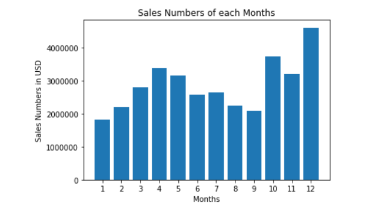
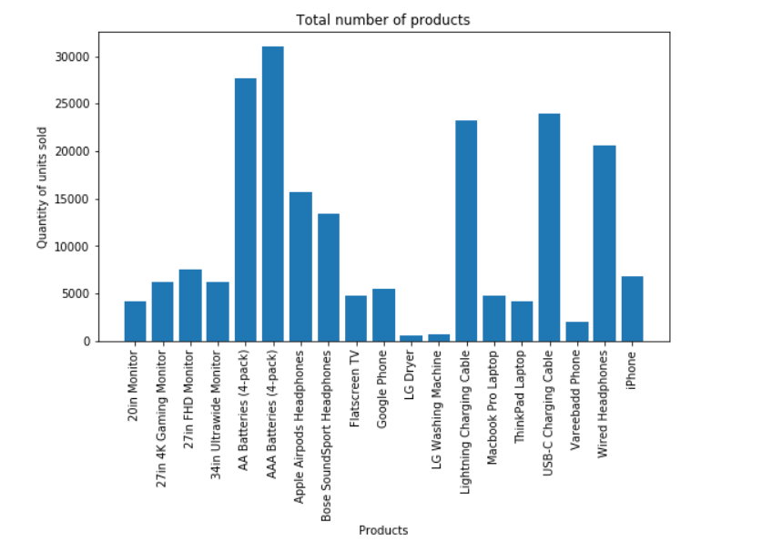

# Sales-Data-Analysis

# Purpose of this analysis:
1. To gain insight into analysis sales data
2. To improve Python coding skills

# Monthly sales numbers:

# Monthly sales numbers per city:
.png)

# Total number of sales of each product:

